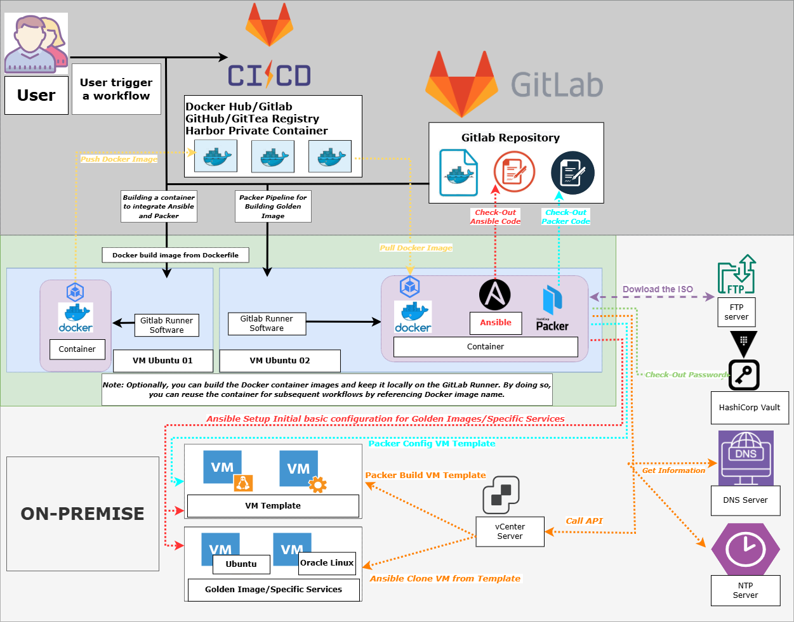

# demo-vm-template

## Table of Contents

1. [Introduction](#introduction)
2. [Topology](#topology)
3. [Requirements](#requirements)
4. [Configuration](#configuration)

## Introduction

This repository provides infrastructure-as-code to automate the creation of template systems ( Ubuntu and Oracle Linux multiple versions ) on VMware vSphere using HashiCorp Packer and Ansible. By default, VM image artifacts are created by DVD ISO

The build process is automated using Gitlab CI and can be triggered manually or on a schedule. You can modify the Packer template to customize the configuration of the virtual machine image.

To use this Gitlab CI, you need to provide the following inputs:

-    `Site`: Env information of the executed site ( check `build-env/` )

The inputted `Site` are used by Packer to configure the network settings of the VM template during the build process, and these settings will be used at the final stage by scripts `initialize.sh` . These settings are important as they allow the guest operating system to communicate with the outside world and other machines on the network.

The reason why we need to enter the correct value for `Site` is because the task executes commands based on the input values, the directory structure and file name. 

If we enters an incorrect value for either of these parameters, the task will not be able to locate the correct directory and will fail to execute the specified tests which will result in a `No such file or directory error`. 

Therefore, it is important for enter the correct values to ensure that the workflows runs successfully and executes the correct tests for the specified environment (`sat-sg1` or `prd-sg1` ,....) .

### Gitlab CI - Building a container to integrate Ansible and Packer

`Building a container to integrate Ansible and Packer` workflow  provided in this repository automates the process of building a container to integrate Ansible and Packer. The workflow is triggered manually or through workflow dispatch event and performs the following steps:

1. **Checks out the source code from the repository.**
2. **Logs into the Docker Hub or Harbor Private Container using credentials (optional).**
3. **Sets up Docker buildx for multi-platform builds.**
4. **Extracts Docker metadata.**
5. **Builds Docker image and keep in Gitlab Runner Local.**
6. **Pushes the Docker image to the Docker Hub or Harbor Private Container with specified tags and labels (optional).**

```note
Note: Optionally, you can build the Docker container images and keep it locally on the GitLab Runner. 
By doing so, you can reuse the container for subsequent workflows by referencing Docker images name.
```

### Gitlab CI  - Packer Pipeline for Building Golden Image

`Packer Pipeline for Building Golden Image` workflow automates the process of building Golden Image using Packer and Ansible. Below is an explanation of each step:

1. **check-syntax-yml (Check YAML files)**:
   - This GitLab CI task is designed to ensure the quality and consistency of YAML files by using the `yamllint` tool. 

2. **pre (before_script)**:
   - This job runs on a self-hosted runner and loads environment variables from the specified environment file. (`build-env/`)
   - It sets up necessary environment variables required for subsequent jobs.

3. **packer-create (Build Packer Template)**:
   - This job also runs on a self-hosted runner and utilizes.
   - It checks out the source code and loads environment variables.
   - Packer is initialized and then used to build the VM template based on the specified configuration.
   - After the template is built, Ansible is used to configure the template for Kafka deployment.

4. **ansible-config (Run Ansible config template)**:
   - Ansible is used to configure the VM template for Kafka deployment. ( using file inventory **ansible/`build_site`/.../...**)
   - It utilizes the `template-configuration.yml` playbook and sets various environment variables required for configuration.

## Topology




## Requirements

**Platform**:

- VMware vSphere 7.0 Update 3D or later.
- Ansible-Core 2.13.
- HashiCorp Packer 1.10.0 or higher.

```note
Note: This Gitlab CI workflow is currently dependent on the SAT Environment
```

## Configuration

<details>
   <summary><i><b>The directory structure of the repository.</b></i></summary> 

   ```console
    ├── ansible
    │   ├── ansible.cfg
    │   ├── clear-template.yml
    │   ├── inventories
    │   │   ├── prd-sg1
    │   │   │   ├── group_vars
    │   │   │   │   └── all.yml
    │   │   │   └── hosts
    │   │   └── sat-sg1
    │   │       ├── group_vars
    │   │       │   └── all.yml
    │   │       └── hosts
    │   ├── roles
    │   │   ├── oracle
    │   │   │   ├── defaults
    │   │   │   │   └── main.yml
    │   │   │   ├── files
    │   │   │   │   └── force-sync.sh
    │   │   │   ├── tasks
    │   │   │   │   ├── main.yml
    │   │   │   │   └── oracle.yml
    │   │   │   └── templates
    │   │   │       └── add-packages.sh.j2
    │   │   └── ubuntu
    │   │       ├── defaults
    │   │       │   └── main.yml
    │   │       ├── files
    │   │       │   └── force-sync.sh
    │   │       ├── tasks
    │   │       │   ├── main.yml
    │   │       │   └── ubuntu.yml
    │   │       └── templates
    │   │           └── add-packages.sh.j2
    │   └── template-configuration.yml
    ├── build-env
    │   ├── prd-sg1.env
    │   ├── sat-sg1.env
    │   └── spec_rsa
    ├── Dockerfile
    ├── LICENSE
    ├── manifests
    ├── packer
    │   ├── linux
    │   │   ├── general.pkrvars.hcl
    │   │   ├── oracle
    │   │   │   ├── data
    │   │   │   │   └── ks.pkrtpl.hcl
    │   │   │   ├── linux-oracle.auto.pkrvars.hcl
    │   │   │   ├── linux-oracle.pkr.hcl
    │   │   │   └── variables.pkr.hcl
    │   │   └── ubuntu
    │   │       ├── data
    │   │       │   ├── meta-data
    │   │       │   ├── storage.pkrtpl.hcl
    │   │       │   └── user-data.pkrtpl.hcl
    │   │       ├── linux-ubuntu.auto.pkrvars.hcl
    │   │       ├── linux-ubuntu.pkr.hcl
    │   │       └── variables.pkr.hcl
    │   └── packer-data.json
    ├── README.md
    ├── requirements
    │   ├── requirements.apt
    │   ├── requirements.txt
    │   └── requirements.yml
   ```
</details>

### Dockerfile

This Dockerfile installs necessary dependencies, including Docker, Ansible . It also downloads and installs the specified version of Packer. Additionally, it installs dependencies listed in the `requirements.apt`, `requirements.txt` and `requirements.yml` files respectively.

### Packer

The packer directory contains the Packer build templates for each of the supported guest operating systems. The build process can be customized using variables defined in the `*.pkr.hcl` and `*.auto.pkrvars.hcl` files.

#### Common Variables

Edit the `packer\linux-rocky.auto.pkrvars.hcl` file to configure the following:

```hcl
// vSphere Credentials & Settings - Input from Gitlab CI Workflow & file build-env/***.env

vsphere_endpoint                = "The fully qualified domain name or IP address of the vCenter Server instance."
vsphere_username                = "The username to login to the vCenter Server instance."
vsphere_password                = "The password for the login to the vCenter Server instance."

// vSphere Settings
...

// Guest Operating System Virtual Machine & Virtual Machine Settings

vm_guest_os_language                  = "en_US.UTF-8"
vm_guest_os_keyboard                  = "us"
vm_guest_os_timezone                  = "Asia/Ho_Chi_Minh"
vm_guest_os_type                      = "ubuntu64Guest"
vm_firmware                           = "efi-secure"
vm_cpu_count                          = 2
vm_cpu_cores                          = 2
vm_cpu_hot_add                        = true
vm_mem_size                           = "4096"
vm_mem_hot_add                        = true
vm_disk_controller_type               = ["pvscsi"]
vm_disk_size                          = "51200"
vm_disk_thin_provisioned              = true
vm_network_card_type                  = "vmxnet3"
vm_version                            = "19"
vm_usb_controller                     = ["xhci"]
vm_remove_cdrom                       = true
vm_tools_upgrade_policy               = true
```

#### Data Source Options

```hcl
common_data_source = "disk"
```

`http` is the default provisioning data source for Linux machine image builds.

You can change the `common_data_source` from `http` to `disk` to build supported Linux machine images without the need to use Packer's HTTP server. This is useful for Docker environments that may not be able to route back to the system from which Packer is running.

### Ansible

After Packer builds the VM template, Ansible takes over to configure the template and deploy Kafka instances. Here's how Ansible handles the tasks:

#### Configuring VM from Packer Template:

Ansible runs the `template-configuration.yml` playbook to configure the VM template generated by Packer.

This playbook sets up various settings and configurations required for Kafka deployment.

- Includes the `Ubuntu/Oracle` Ansible role, which contains configurations specific to Ubuntu/Oracle Linux . Variables such as vSphere credentials and VM settings are passed from the environment files.
